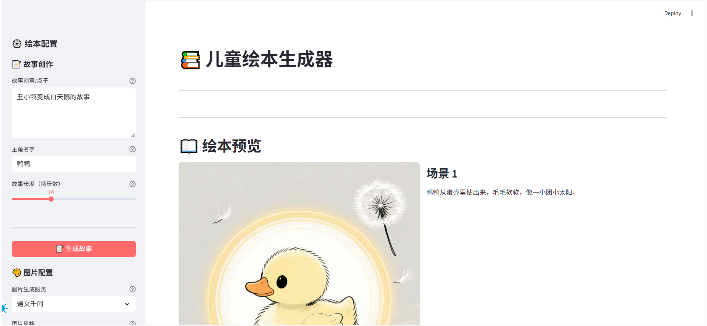
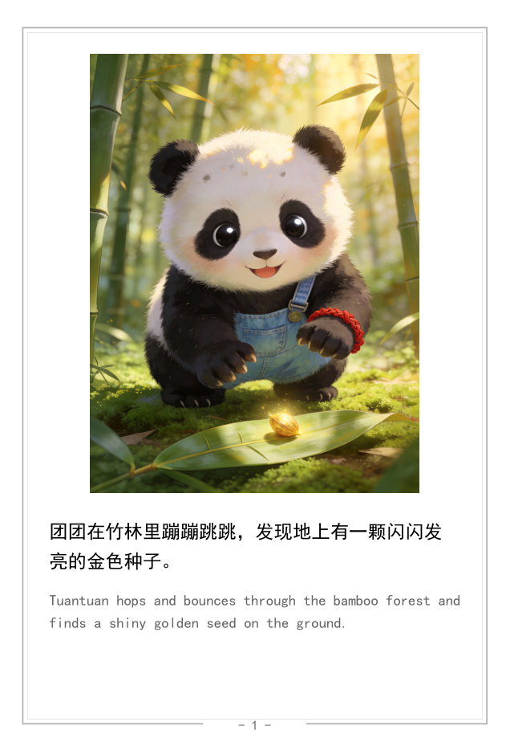

# StoryCraft 📚

> AI搭載の子供向け絵本ジェネレーター（3-5歳対象）

[](https://github.com/cn-vhql/StoryCraft)
[](https://www.python.org/downloads/)
[](LICENSE)
[](https://streamlit.io/)

**English** | [简体中文](README.zh.md) | **日本語**

---

## 🌟 このプロジェクトについて

**これは、雲パパから娘の雲への贈り物です。**

すべての子供は独自の物語を持つ権利があります。StoryCraftはAIの力を借りて、子供たちのための想像力豊かな世界を織り上げ、眠る時間を温かく特別なものにします。

**すべての子供が愛に包まれ、物語と一緒に甘い夢を見られることを願っています。**

---

## ✨ 機能

- **AI物語生成** - 創造的なアイデアを入力すると、AIが完全な物語を作成
- **自動イラスト生成** - 各ページに美しい画像を自動生成
- **バイリンガル対応** - 言語学習のための中国語と英語
- **PDF出力** - Kindle電子書籍リーダーとタブレットに最適化
- **8つのアートスタイル** - 漫画、アニメ、中国伝統、水彩など
- **カスタマイズ可能** - 物語を編集、画像を再生成、コンテンツをパーソナライズ

**最適対象**: パーソナライズされた本を作る親、教育用教材を作る教育者、子供たちのために独自の物語を作るすべての人

---

## 🚀 クイックスタート（5分）

### 前提条件

- **Python 3.11+** がインストールされていること
- **APIキー** （Tongyi Qianwenから、無料利用枠あり）

### インストール

```bash
# 1. リポジトリをクローン
git clone https://github.com/cn-vhql/StoryCraft.git
cd StoryCraft

# 2. 依存関係をインストール
pip install -r requirements.txt

# 3. APIキーを設定
cp .env.example .env
# .envを編集してAPIキーを追加

# 4. アプリケーションを実行
streamlit run src/app.py
```

アプリケーションは自動的にブラウザで `http://localhost:8501` で開きます

---

## 📖 詳細セットアップガイド

### ステップ1：Pythonのインストール

1. [python.org](https://www.python.org/downloads/)からPythonをダウンロード
2. Python 3.11以降をインストール
3. **重要**: インストール時に「PythonをPATHに追加」にチェックを入れる

インストールを確認:
```bash
python --version
```

### ステップ2：APIキーの取得

StoryCraftはAIサービスを使用して物語と画像を生成します。APIキーが必要です：

#### オプション1：Tongyi Qianwen（初心者におすすめ）

1. [Alibaba Cloud百錬プラットフォーム](https://bailian.console.aliyun.com/)にアクセス
2. アカウントに登録/ログイン
3. 「通義千問」サービスを有効化（新規ユーザーは無料利用枠あり）
4. APIキーを作成

#### オプション2：Doubao（より高速な画像生成）

1. [火山エンジンコンソール](https://console.volcengine.com/ark)にアクセス
2. 推論エンドポイントを作成してAPIキーを取得
3. `.env`ファイルに追加（以下の設定を参照）

**💡 ヒント**: Tongyi Qianwenから始めましょう - 設定が簡単で初心者に優しい

### ステップ3：環境設定

プロジェクトルートの`.env`ファイルを編集：

```env
# Tongyi Qianwen設定
API_KEY=sk-your-api-key-here
API_ENDPOINT=https://dashscope.aliyuncs.com/compatible-mode/v1
TEXT_MODEL=qwen-plus
IMAGE_SERVICE=tongyi

# オプション：Doubao設定
ARK_API_KEY=your-doubao-key-here
IMAGE_SERVICE=doubao

# 画像設定
IMAGE_SIZE=1104x1472  # 3:4縦長、絵本に適している

# アプリケーション設定
MAX_SCENES=30
MIN_SCENES=1
DEFAULT_SCENES=10
```

### ステップ4：アプリケーション起動

```bash
streamlit run src/app.py
```

ブラウザで `http://localhost:8501` にアクセス

---

## 🎨 使用チュートリアル

### インターフェース概要



**左サイドバー - 設定**:
- 📝 **物語作成**: アイデア、キャラクター名、物語の長さを入力
- 🎨 **画像設定**: スタイルとサイズを選択
- 🔄 **再生成**: 不満な画像を再生成

**メインエリア - 操作**:
1. 物語を生成（中国語）
2. 物語を編集・確認
3. イラストを生成（自動翻訳+自動画像生成）
4. プレビューとPDFダウンロード

### 最初の絵本を作成

#### 1. 物語のアイデアを入力

```
例：小さなウサギが森で魔法の種を見つけ、
毎日水をやり、キャンディの木に育つ...
```

#### 2. キャラクターに名前を付ける

```
例：ウサギちゃん、小熊、ドウドウ
```

#### 3. 物語の長さを選択

```
推奨：3-10シーン（各シーン=1ページ）
```

#### 4. 「物語を生成」をクリック

```
AIが自動的に中国語の物語を作成
```

#### 5. 物語内容を編集（オプション）

```
気に入らない場合は、任意のページのテキストを変更
```

#### 6. 画像スタイルを選択

| スタイル | 特徴 | 最適な用途 |
|-------|------|----------|
| **漫画** | 白黒の線、クリーン | Kindle電子書籍 |
| **アニメ** | カラフル、鮮やか | カラータブレット |
| **中国風** | 伝統的な水墨画 | 文化的テーマ |
| **水彩** | 柔らかい、芸術的 | 優しい物語 |
| **カートゥーン** | かわいい、シンプル | 3-5歳 |
| **油絵** | 豊かな色彩、3D効果 | 芸術的鑑賞 |
| **水彩画** | 軽やか、空気感 | 温かい物語 |
| **古典** | ヨーロッパ油絵 | 童話 |

#### 7. 「絵本を生成」をクリック

```
AIが自動的に：
- すべてのシーンを英語に翻訳
- 各ページのイラストを生成
```

#### 8. プレビューとダウンロード

```
タイトルと著者名を入力
「PDFを生成してダウンロード」をクリック
```



---

## 📂 出力ファイル構造

生成されたファイルはタイムスタンプで整理されて`output/`ディレクトリに保存：

```
output/
└── 20260125_143000_LittleRabbit/
    ├── scene_1.png              # ページ1のイラスト
    ├── scene_2.png              # ページ2のイラスト
    ├── scene_3.png              # ページ3のイラスト
    ├── story_draft.txt          # 物語のドラフト（テキスト版）
    └── LittleRabbit_Story.pdf   # 最終PDF絵本
```

---

## ⚙️ 高度な設定

### PDFファイルサイズの削減

```env
PDF_IMAGE_QUALITY=70           # 画像圧縮（1-100、デフォルト85）
PDF_MAX_IMAGE_DIMENSION=1024    # 最大画像サイズ（デフォルト1200）
```

### フォントサイズの調整

```env
FONT_SIZE=20                   # フォントサイズ（デフォルト24）
```

### サポートされている画像サイズ

**Tongyi Qianwen (wan2.6-t2i):**
- `1104x1472`（3:4縦長、推奨）
- `1280x1280`（1:1正方形）
- `960x1280`（3:4縦長）
- `1472x1104`（4:3横長）
- `960x1696`（9:16縦長）

**Doubao:**
- `1920x2560`（3:4縦長、推奨）
- `2048x2730`（3:4縦長、HD）
- `2048x2048`（1:1正方形）
- `2560x1920`（4:3横長）
- `2048x1536`（4:3横長小）

---

## 🔧 トラブルシューティング

### エラー：`ModuleNotFoundError: No module named 'streamlit'`

**解決策:**
```bash
pip install -r requirements.txt
```

### エラー：`Invalid API Key`

**解決策:**
- `.env`ファイルのAPI_KEYが正しいか確認
- APIキーが必要なサービスが有効化されているか確認
- ネットワーク接続を確認

### エラー：画像生成に失敗

**解決策:**
- APIキーが画像生成権限を持っているか確認
- シーン数を減らしてみる
- 画像生成サービスを切り替え（Tongyi ⇄ Doubao）

### ログの確認

```bash
# 最近のログを表示
tail -f output/app.log
```

---

## 💡 使用のヒント

1. **物語のアイデアは具体的に**
   - ✅ 「ウサギが魔法の種を見つけ、毎日水をやり、キャンディの木に育つ」
   - ❌ 「子供の物語を書いて」

2. **キャラクター名はシンプルに**
   - ✅ 「ウサギちゃん」「ドウドウ」「ミンミン」
   - ❌ 「アレクサンダー・ニコラエヴィッチ」

3. **シーン数は適度に**
   - ✅ 3-10シーン
   - ❌ 30シーン（生成に長時間かかります）

4. **ダウンロード前にプレビュー**
   PDFを生成する前に画像をプレビュー

5. **編集機能を活用**
   AIが生成した物語は自由に変更でき、ニーズに合わせて調整可能

---

## 🤝 貢献

貢献を歓迎します！お気軽にプルリクエストを送信してください。

1. リポジトリをフォーク
2. 機能ブランチを作成（`git checkout -b feature/AmazingFeature`）
3. 変更をコミット（`git commit -m 'Add some AmazingFeature'`）
4. ブランチにプッシュ（`git push origin feature/AmazingFeature`）
5. プルリクエストを開く

---

## 📄 ライセンス

このプロジェクトはMITライセンスの下でライセンスされています - 詳細は[LICENSE](LICENSE)ファイルを参照してください

---

## 🙏 謝辞

以下のオープンソースプロジェクトとサービスに感謝します：

- [Streamlit](https://streamlit.io/) - Webフレームワーク
- [ReportLab](https://www.reportlab.com/) - PDF生成
- [Tongyi Qianwen](https://tongyi.aliyun.com/) - AIサービス
- [Doubao](https://www.doubao.com/) - AIサービス

---

## 📞 お問い合わせ

- 🐛 **バグ報告**: [Issueを提出](https://github.com/cn-vhql/StoryCraft/issues)
- 💬 **ディスカッション**: [作品をシェア](https://github.com/cn-vhql/StoryCraft/discussions)

---

## ⚠️ 免責事項

このプロジェクトで生成される絵本のコンテンツは完全にAIによって生成されます。子供に読み聞かせる前に、保護者はコンテンツの適切性を確認してください。

---

**子供たちへの愛を込めて ❤️ | AIで子供たちのために美しい物語を作成**
