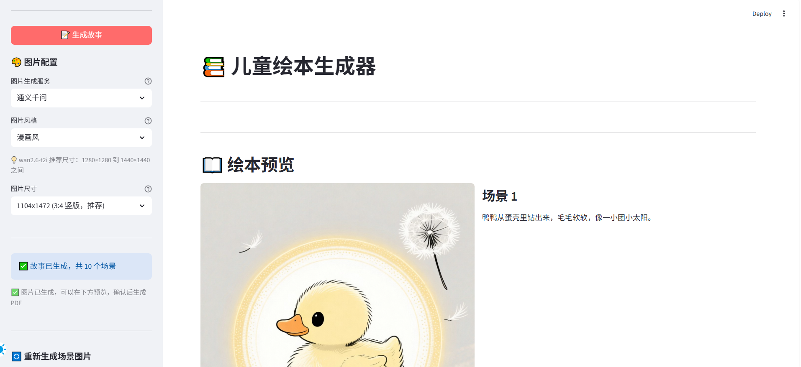
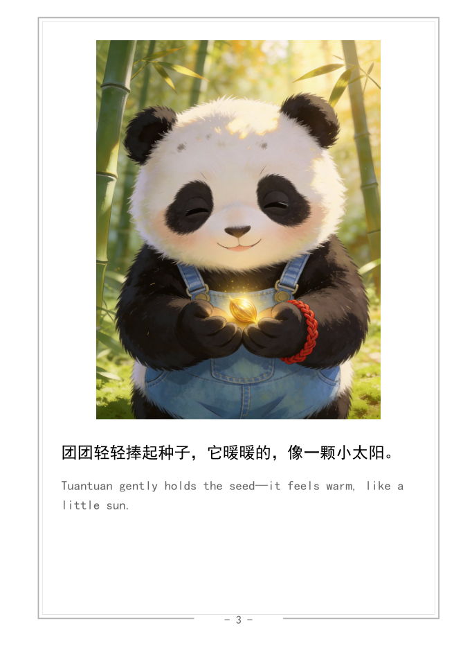

# 儿童绘本生成器 📚

使用 AI 为 3-5 岁儿童生成原创故事绘本的 Web 应用，支持导出适合 Kindle 电子墨水屏阅读的 PDF 格式。


## ❤️ 关于本项目

这是云朵爸爸送给女儿**云朵**的一份特别的礼物。

每一个孩子都值得拥有属于自己的独一无二的故事。我希望通过这个项目，让 AI 帮助我们为孩子们编织充满想象力的世界，让每个睡前时光都变得温馨而特别。

愿所有的孩子都被爱意包围，在故事的陪伴下甜甜入睡。

---

## 🎯 能做什么

- ✨ **输入一个创意**，AI 自动创作完整故事
- 🎨 **自动生成插画**，每页都有精美配图
- 📱 **一键生成 PDF**，适合在 Kindle/iPad 上阅读
- 🌍 **中英双语**，让孩子在故事中学习英语

**非常适合**：父母为孩子制作专属绘本、 educators 制作教学材料、任何想为孩子创造独特故事的人

---

## 🚀 快速开始（5分钟上手）

### 第一步：安装 Python（如果还没安装）

1. 访问 [https://www.python.org/downloads/](https://www.python.org/downloads/)
2. 下载并安装 Python 3.10 或更高版本
3. 安装时勾选 "Add Python to PATH"

**检查是否安装成功**：打开命令行/终端，输入 `python --version`

### 第二步：下载项目

```bash
# 1. 下载项目代码
git clone https://github.com/cn-vhql/StoryCraft.git
cd StoryCraft

# 2. 安装依赖
pip install -r requirements.txt
```

### 第三步：配置 API 密钥

**为什么要配置？**
本项目使用 AI 服务生成故事和图片，需要 API 密钥（类似会员卡）

#### 方案一：使用通义千问（推荐新手）

1. 访问 [阿里云百炼平台](https://bailian.console.aliyun.com/)
2. 注册/登录账号
3. 开通「通义千问」服务（新用户有免费额度）
4. 创建 API Key

**配置方法**：

```bash
# 复制配置文件模板
cp .env.example .env

# 编辑 .env 文件，填入你的 API Key
```

在 `.env` 文件中填入：

```env
API_KEY=sk-你的API密钥
API_ENDPOINT=https://dashscope.aliyuncs.com/compatible-mode/v1
TEXT_MODEL=qwen-plus
IMAGE_SERVICE=tongyi
```

#### 方案二：使用豆包（更快的图片生成）

1. 访问 [火山引擎](https://console.volcengine.com/ark)
2. 创建推理接口，获取 API Key
3. 在 `.env` 文件中额外添加：

```env
ARK_API_KEY=你的豆包Key
IMAGE_SERVICE=doubao
```

**💡 提示**：推荐使用通义千问，配置简单，新手友好

### 第四步：运行程序

```bash
streamlit run src/app.py
```

程序会自动在浏览器打开（通常是 http://localhost:8501）

---

## 📖 使用教程

### 界面介绍




**左侧边栏 - 配置区**：

- 📝 **故事创作**：输入创意、主角名、故事长度
- 🎨 **图片配置**：选择风格和尺寸
- 🔄 **重新生成**：对不满意的图片重新生成

**主区域 - 操作区**：

- 第一步：生成故事（中文）
- 第二步：编辑和确认故事
- 第三步：生成插画（自动翻译 + 自动生成图片）
- 第四步：预览和下载 PDF

### 制作你的第一本绘本

1. **输入故事创意**

   ```
   例如：小兔子在森林里发现了一颗神奇的种子，
   它每天浇水，种子长成了一棵结满糖果的树...
   ```

2. **给主角起个名字**

   ```
   例如：小兔子、小熊、朵朵等
   ```

3. **选择故事长度**

   ```
   建议：3-10 个场景（每个场景一页）
   ```

4. **点击「生成故事」**

   ```
   AI 会自动创作中文故事
   ```

5. **编辑故事内容**（可选）

   ```
   如果不满意，可以修改任何一页的文字
   ```

6. **选择图片风格**

   ```
   漫画风：黑白线条，适合 Kindle
   动漫风：彩色鲜艳，适合 iPad
   中国风：传统国画风格
   卡通：可爱简单，适合低龄儿童
   ```

7. **点击「生成绘本」**

   ```
   AI 会自动：
   - 翻译所有场景成英文
   - 为每页生成插画
   ```

8. **预览和下载**
   ```
   满意后输入标题和作者名
   点击「生成并下载 PDF」
   ```




### 常见问题

**Q: API 密钥要花钱吗？**
A: 通义千问和豆包都有免费额度。普通使用（生成几本绘本）完全够用。

**Q: 生成一个绘本需要多久？**
A: 约 2-5 分钟，取决于场景数量和图片尺寸。

**Q: 可以修改生成的内容吗？**
A: 当然！故事文字可以随意编辑，图片也可以重新生成。

**Q: 生成的 PDF 能在哪些设备上看？**
A: 任何支持 PDF 的设备：Kindle、iPad、手机、电脑等。

**Q: 图片生成失败了怎么办？**
A: 检查 API 密钥是否正确配置，网络是否正常。也可以尝试切换图片生成服务。

---

## 📂 输出文件说明

生成的文件会保存在 `output/` 目录下，按时间自动分类：

```
output/
└── 20260125_143000_小兔子/
    ├── scene_1.png          # 第 1 页插图
    ├── scene_2.png          # 第 2 页插图
    ├── scene_3.png          # 第 3 页插图
    ├── story_draft.txt      # 故事草稿（文字版）
    └── 小兔子的故事.pdf     # 最终 PDF 绘本
```

---

## 🎨 图片风格选择

| 风格   | 特点                 | 推荐场景      |
| ------ | -------------------- | ------------- |
| 漫画风 | 黑白线条，清晰简洁   | Kindle 电子书 |
| 动漫   | 彩色鲜艳，日式风格   | 彩色平板      |
| 中国风 | 传统国画，优雅古典   | 国学主题      |
| 水墨画 | 淡雅水彩，艺术感强   | 文艺风格      |
| 卡通   | 可爱简单，儿童友好   | 3-5岁儿童     |
| 油画   | 浓厚色彩，立体感强   | 艺术欣赏      |
| 水彩   | 轻盈透气，柔和清新   | 温馨故事      |
| 古典   | 欧洲油画，博物馆品质 | 经典童话      |

---

## 📋 进阶配置（可选）

如果你想自定义更多设置，可以编辑 `.env` 文件：

### 调整图片质量（减小 PDF 文件大小）

```env
PDF_IMAGE_QUALITY=70           # 图片压缩质量 (1-100，默认85)
PDF_MAX_IMAGE_DIMENSION=1024    # 图片最大尺寸（默认1200）
```

### 调整 PDF 字体大小

```env
FONT_SIZE=20                   # 字体大小（默认24）
```

---

## 🛠️ 技术支持

### 常见错误排查

**错误 1：`ModuleNotFoundError: No module named 'streamlit'`**

解决方法：

```bash
pip install -r requirements.txt
```

**错误 2：`API Key 无效`**

解决方法：

- 检查 `.env` 文件中 API_KEY 是否正确
- 确认 API 密钥是否已开通对应服务
- 检查网络连接

**错误 3：图片生成失败**

解决方法：

- 确认 API 密钥有图片生成权限
- 尝试减少场景数量
- 切换图片生成服务（通义千问 ⇄ 豆包）

### 查看日志

如果遇到问题，可以查看日志文件：

```bash
# 查看最近的日志
tail -f output/app.log
```

---

## 💡 使用技巧

1. **故事创意要具体**
   ✅ "小兔子发现一颗神奇种子，每天浇水，长成糖果树"
   ❌ "写一个儿童故事"

2. **主角名字要简单**
   ✅ "小兔子"、"朵朵"、"明明"
   ❌ "亚历山大·尼古拉耶维奇"

3. **场景数量适中**
   ✅ 3-10 个场景
   ❌ 30 个场景（生成时间会很长）

4. **先预览再下载**
   生成完图片后先预览，满意了再生成 PDF

5. **善用编辑功能**
   AI 生成的故事可以随意修改，让它更符合你的需求

---

## 🌟 结语

**愿所有的孩子都被爱意包围，在故事的陪伴下甜甜入睡。**

致每一位为孩子创造美好回忆的父母，愿这份小小的工具能为你们的家庭时光增添一份温馨。

---

## 📄 开源协议

本项目采用 MIT 许可证 - 详见 [LICENSE](LICENSE) 文件

---

## 🙏 致谢

感谢以下开源项目和服务：

- [Streamlit](https://streamlit.io/) - Web 框架
- [ReportLab](https://www.reportlab.com/) - PDF 生成
- [通义千问](https://tongyi.aliyun.com/) - AI 服务
- [豆包](https://www.doubao.com/) - AI 服务

---

## 📞 联系方式

- 🐛 **问题反馈**：[提交 Issue](https://github.com/cn-vhql/StoryCraft/issues)
- 💬 **使用交流**：欢迎在 Discussions 区分享你的作品

---

**注意**: 本项目生成的绘本内容完全由 AI 生成，使用前请家长审核内容是否适合儿童阅读。
